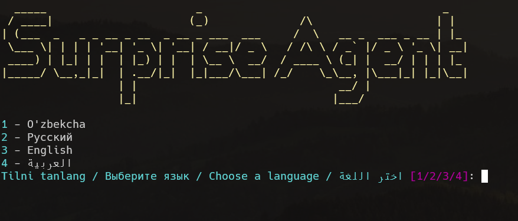

# 📌 SurpriseAgent

SurpriseAgent is a simple yet powerful tool that retrieves information from Wikipedia and saves it into a `.txt` file.



## 🚀 Installation and Usage

### 1️⃣ Clone the Repository

Open PowerShell or Terminal and run the following command:

```sh
git clone https://github.com/KozimovBekzodbek/SurpriseAgent.git
```

Navigate to the project directory:

```sh
cd SurpriseAgent
```

### 2️⃣ Set Up a Virtual Environment

To manage dependencies properly, create a virtual environment.

**Windows:**

```sh
py -m venv venv
```

```sh
python -m venv venv
```

**Linux/macOS:**

```sh
python3 -m venv venv
```

### 3️⃣ Activate the Virtual Environment

**Windows (PowerShell):**

```sh
venv\Scripts\Activate
```

**Windows (Command Prompt):**

```sh
venv\Scripts\activate.bat
```

**Linux/macOS:**

```sh
source venv/bin/activate
```

### 4️⃣ Install Dependencies

Run the following command to install required dependencies:

```sh
pip install -r requirements.txt
```

### 5️⃣ Run the Program

**Windows:**

```sh
py SurpriseAgent.py
```

**Linux/macOS:**

```sh
python3 SurpriseAgent.py
```


## 💡 Why Use a Virtual Environment?

✔️ Prevents conflicts between different Python projects.

✔️ Keeps dependencies local to the project.

✔️ Ensures smooth sharing and deployment across systems.

## 🛠️ Contributions

Feel free to fork this repository, create a feature branch, and submit a pull request! 🚀


